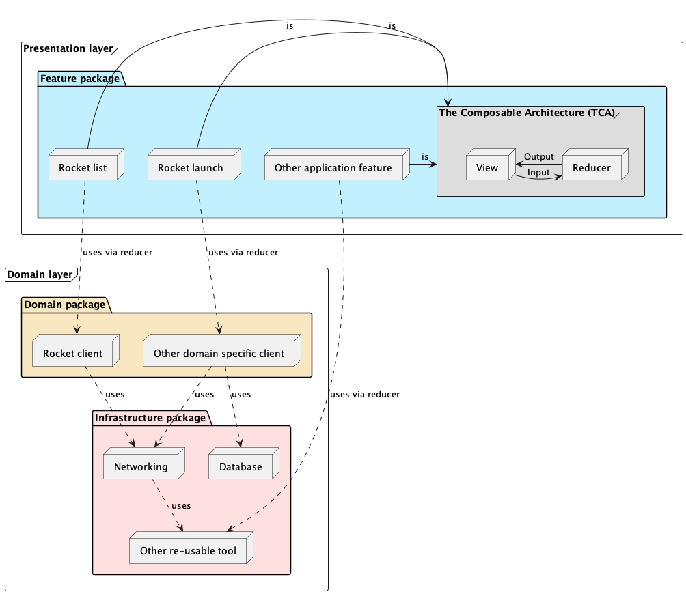

# iOS solution

## Table of contents

- [Architecture](#architecture)
- [Clean Architecture principles](#clean-architecture-principles)

## Architecture

<!--
@startuml ios-architecture

frame "Domain layer" {
   package "Infrastructure package" #Implementation {
      node Networking
      node Database
      node "Other re-usable tool"

      Networking ..> "Other re-usable tool" : uses
   }

   package "Domain package" #Strategy {
      node "Rocket client"
      node "Other domain specific client"
   }

   "Rocket client" ..> Networking: uses
   "Other domain specific client" ..> Networking : uses
   "Other domain specific client" ..> Database : uses
}

frame "Presentation layer" {
   package "Feature package" #Application {
      node "Rocket list" 
      node "Rocket launch"
      node "Other application feature"

      frame "The Composable Architecture (TCA)" #DDDDDD {
         node Reducer
         node View 

         Reducer -> View : Output
         View -> Reducer : Input
      }

      "Rocket list" -> "The Composable Architecture (TCA)" : is
      "Rocket launch" -> "The Composable Architecture (TCA)" : is
      "Other application feature" -> "The Composable Architecture (TCA)" : is
   }
}

"Rocket list" ..> "Rocket client" : uses via reducer
"Rocket launch" ..> "Other domain specific client" : uses via reducer
"Other application feature" ..> "Other re-usable tool" : uses via reducer

@enduml

-->

## Clean Architecture principles

